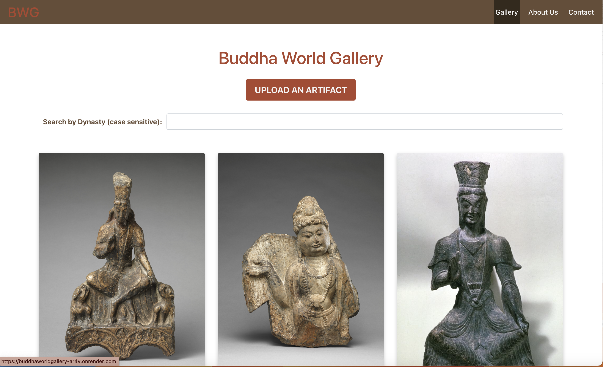
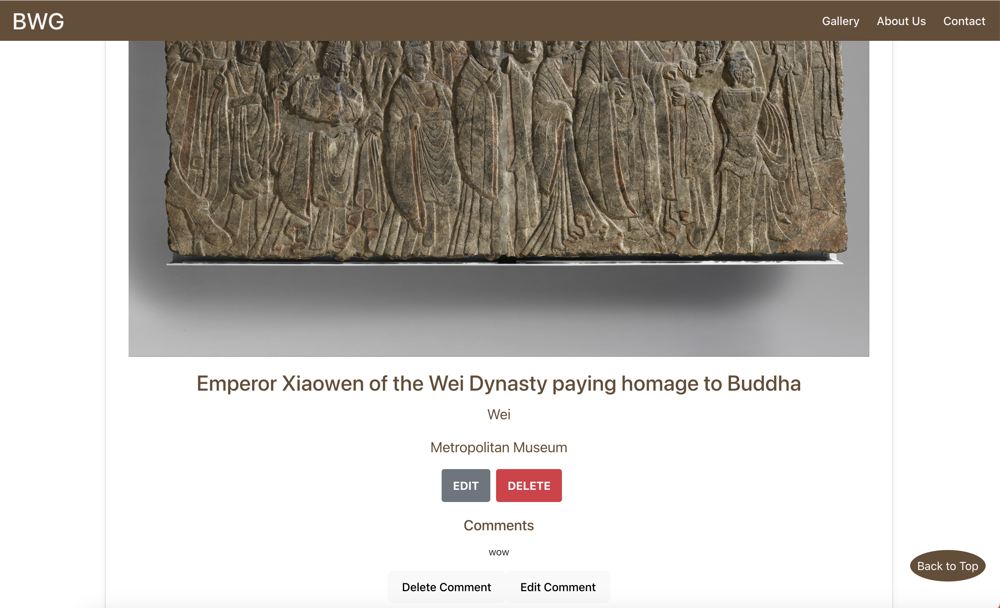
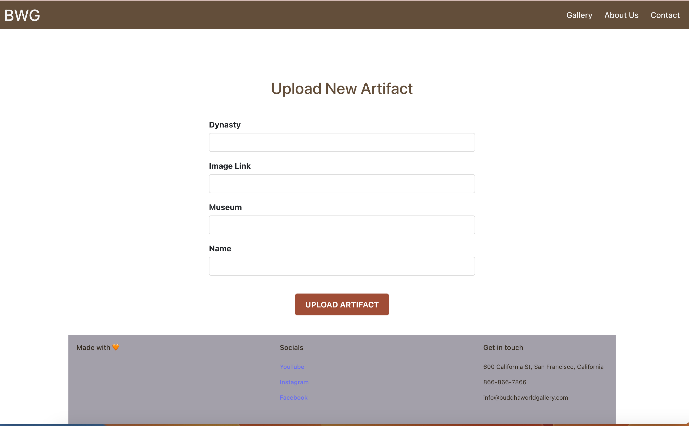
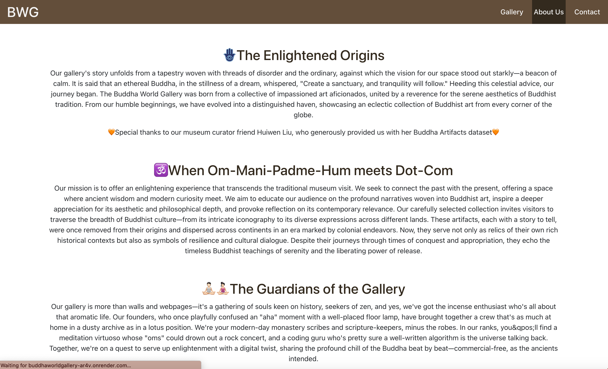
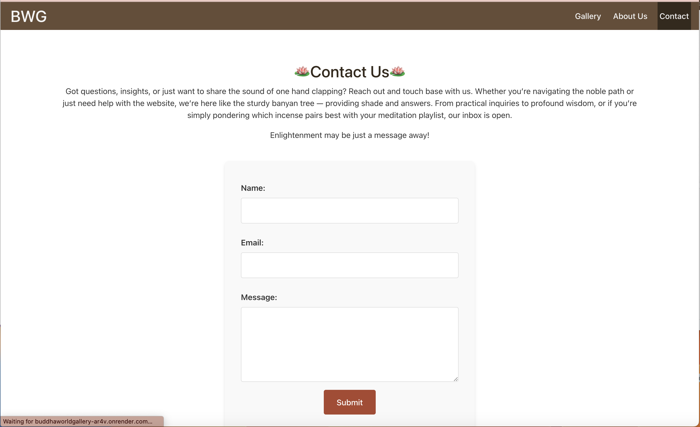

# BuddhaWorldGallery

BuddhaWorldGallery is an online website for art lovers to be able to browse, filter, and upload buddha artifacts across the world. Users will be able to filter artifacts based on the dynasty they like, upload new artifacts to our database, and leave comments about their favorite artifacts.

## Authors

Huiqin Hu & Xiaolin Liu

## Project links

Deployed Site: https://buddhaworldgallery-ar4v.onrender.com/

Walkthrough Video: https://youtu.be/HHam7Jaw86A

Slides: https://docs.google.com/presentation/d/e/2PACX-1vSb4RggmRkXw76P1Rx_Kq70ptaCaZxrPqxt4rqLPdXJSP0fls_F35BlBvAqJqE51zVl9NtKloT6a_yX/pub?start=false&loop=false&delayms=3000

Design Document can be found [here](./design-document.md)

Class Link: https://johnguerra.co/classes/webDevelopment_fall_2023/

## Disclaimer

Some data in this project are synthetic fictitious data and for educational and demonstration purposes only

## Project Objective

1. Create an online gallery to showcase important buddha artifacts across the world

2. Allow Buddhist art lovers to search up artifacts by their historical time periods (dynasty)

3. Allow art lovers across the world to curate this database together - users can “read” the current database through our online gallery, they can also create, update and delete data from our dataset, helping us curate this dataset

4. Allow art lovers across the world to comment below their favorite artifacts - comments could be created, read, updated and deleted

## Screenshots

Main page: gallery


Artifact Detail page


Upload artifact


About us


Contact


## Functionalities / Pages

### Functionalities

- CRUD Operations on Gallery
- CRUD Operations on Comment
- Search Feature on Gallery
- React hook components
- Contact Us Form

### Pages

- Home Page/Gallery Page - users can browse our gallery database, search artifact, and upload an artifact
- Artifact Detail Page - users can edit and delete artifact. They can also see the comment section that belongs to that artifact, as well as being able to edit, delete and upload comments
- About Us: users can read up more about us
- Contact: users can contact us

## Installation

To set up BuddhaWorldGallery, you will need the following:
Clone the repository and then do below to run backend server:

```
npm install
cd front
npm install
npm run dev
cd..
npm run start
```

## Databse

This assumes that you have a Mongo server running on localhost: 27017, or configured in the `MONGOMONGODB_URI` environment variable.
Enter below string to import our database:

```
mongoimport --db buddhaWorld --collection ListedArtifacts --file db/ListedArtifacts.json --jsonArray
```

## Dependencies:

### Backend server

```
"cookie-parser": "~1.4.4",
    "debug": "~2.6.9",
    "dotenv": "^16.3.1",
    "express": "^4.18.2",
    "mongodb": "^6.2.0",
    "morgan": "~1.9.1",
```

### Frontend dependencies

```
"bootstrap": "^5.3.2",
    "dotenv": "^16.3.1",
    "react": "^18.2.0",
    "react-bootstrap": "^2.9.1",
    "react-dom": "^18.2.0",
    "react-hook-form": "^7.48.2",
    "react-router-dom": "^6.18.0"
```

## License

This project is licensed under the MIT License.
