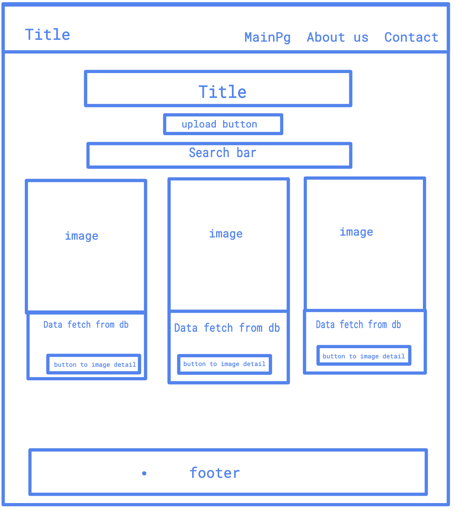
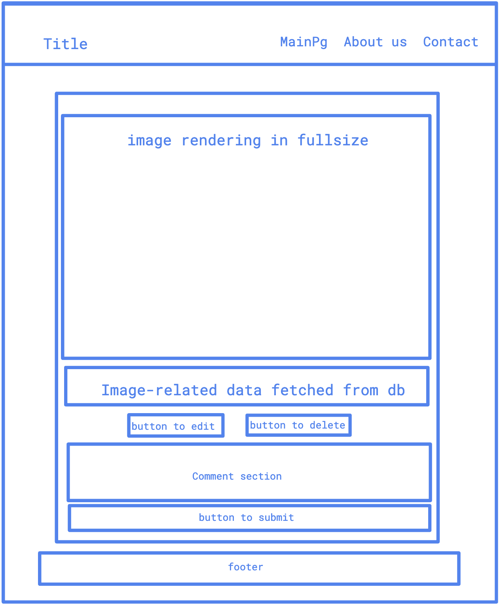
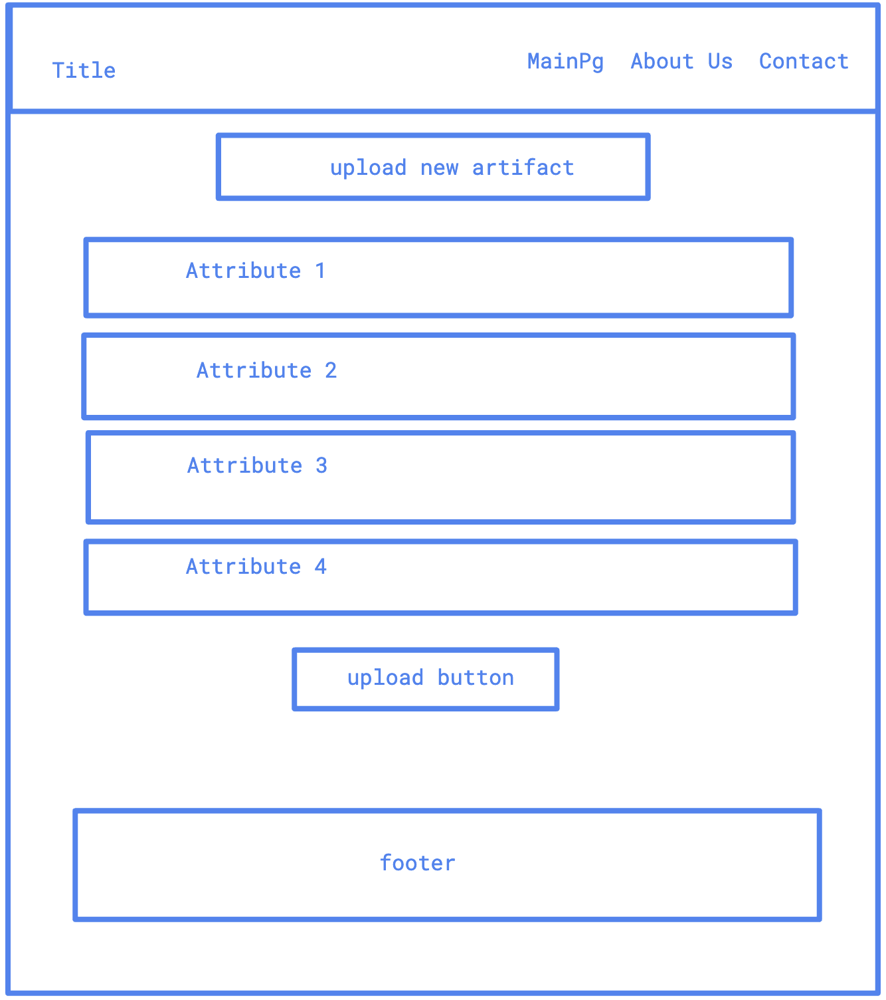
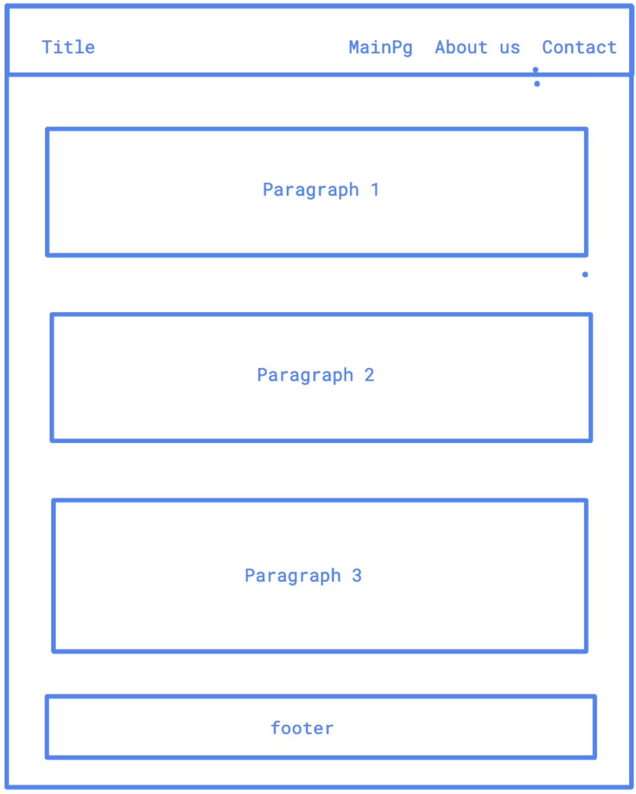
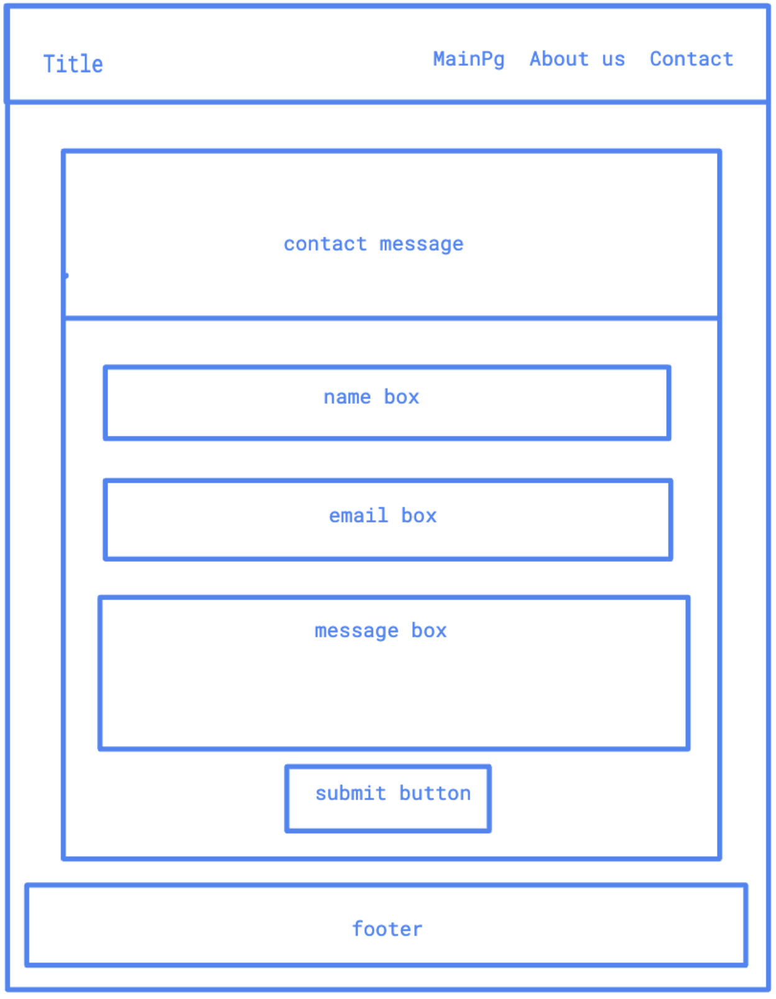
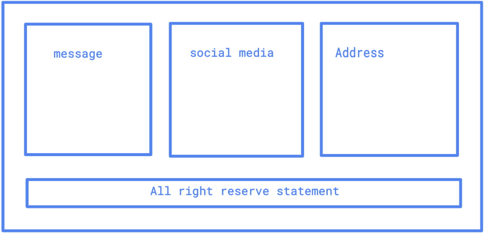

# Design Document for "BuddhaWorld Gallery"

## Project Description:

BuddhaWorldGallery is an online website for art lovers to be able to browse, search, and upload buddha artifacts across the world. Users will be able to search artifacts based on the dynasty they like or the museums they like, upload new artifacts to our database, and leave comments on their favorite artifacts.

## Functionalities and work division:

Gallery MongoDB Collection: Huiqin Hu:
Comment Section MongoDB Collection: Xiaolin Liu
Search Feature: Huiqin Hu
CSS: Xiaolin Liu
Deployment: Huiqin Hu

User Profiles and Personas:

1. The Art Enthusiast:

- Looks for a visually compelling and informative experience.
- Wants the ability to learn about the art's history and context.
- Interested in high-resolution images and potential acquisition information.

2. The Researcher:

- Requires access to detailed historical context and educational material.
- Seeks functionalities for data export and integration with other academic platforms.
- Values the ability to find comprehensive information on the provenance and material of each piece.

3. The Casual Browser:

- Prefers an easy-to-navigate platform for enjoyable and educational browsing.
- Enjoys guided tours and simplified explanations of art pieces.
- Appreciates user-friendly interfaces that enhance the learning experience.

Functionalities:
Database - @Huiqin Greta Hu:
Individual pages for each Buddha head provide detailed information such as image and location, linking directly to the original museum or gallery page
Post: users can share new buddha head artifacts by posting pictures, museum location, and other relevant information
Edit: Users can modify their previously uploaded information to update details
Delete: allow users to remove their postings

Filter and Like - @Huiqin Greta Hu and @Xiaolin Liu
Like: users can give thumbs up to their favorite buddha head artifacts
Filter: users can view buddha head artifacts based on filtering by geographic location, time period, or museum name

Comment Section Interactions (since we are not implementing user authentication / user login, we are treating all users as one user) - @Xiaolin Liu
Comment: Users can leave comment on their favorite artifacts
Edit: Users can modify their previously posted comment to update details
Delete: users can delete their comment
Like: users can give thumbs up to a comment they like

Frontend CSS / page design - @Xiaolin Liu

Mockups:
Main page: gallery

Image detail page

Upload artifact

About us

Contact

Footer

